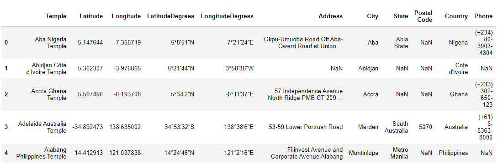

# LDS Temples Far and Wide 


For this project I will analyzing and creating Choropleth Maps from data set found at: [Temples of the Church of Jesus Christ of Latter Day Saints](https://churchofjesuschristtemples.org/maps/downloads/). The CSV file contains the following data fields:

* Temple
* Latitude
* Logitude
* LatitudeDegrees
* LongitudeDegress
* Address
* City
* State 
* Postal Code
* Country
* Phone

## Technology Used
* [Pandas](https://pandas.pydata.org/)
* [MatplotLib](https://matplotlib.org/)
* [Seaborn](https://seaborn-image.readthedocs.io/en/latest/index.html)
* [Plotly](https://plotly.com/python/choropleth-maps/#base-map-configuration)
* [Cufflinks](https://github.com/santosjorge/cufflinks)

## Process
### Analysis

I used pandas to read in the csv data and create a dataframe

```python
data = "Resources/ChurchofJesusChristTemples.csv"
temple_data = pd.read_csv(data)
temple_data.head()
```



I checked the date set for missing values by using isnull() and  how many rows and columns the data set contained by using .shape and nunique() to determine the number of unique values in the temple column. 

#### Questions
How many temples are there world wide?


What are the top 5 countries with temples?


How many temples in the USA?


What are the top 5 US States with temples?


#### Choropleth Map
In order to create two maps based on country and US we need to use pandas .groupby() and filter the data by United States

```python
temples_by_country = temple_data.groupby(['Country'])
united_states = temple_data.loc[temple_data['Country'] == "United States"].reset_index()
```

##### By Country 


##### By United States 
To use the USA States geometry, I need to  provide the  locations as two-letter state abbreviations: The states column contained the full name I used the .map() with this dictionary to map the full state name to the two-letter state abbreviation
```python
us_state_abbrev = {
    'Alabama': 'AL', 'Alaska': 'AK',
    'American Samoa': 'AS', 'Arizona': 'AZ', 'Arkansas': 'AR', 'California': 'CA', 'Colorado': 'CO', 'Connecticut': 'CT', 
    'Delaware': 'DE', 'District of Columbia': 'DC', 'Florida': 'FL', 'Georgia': 'GA', 'Guam': 'GU', 'Hawaii': 'HI',
    'Idaho': 'ID', 'Illinois': 'IL', 'Indiana': 'IN','Iowa': 'IA', 'Kansas': 'KS', 'Kentucky': 'KY','Louisiana': 'LA',
    'Maine': 'ME','Maryland': 'MD', 'Massachusetts': 'MA', 'Michigan': 'MI', 'Minnesota': 'MN', 'Mississippi': 'MS','Missouri': 'MO',
    'Montana': 'MT','Nebraska': 'NE','Nevada': 'NV','New Hampshire': 'NH','New Jersey': 'NJ','New Mexico': 'NM','New York': 'NY',
    'North Carolina': 'NC', 'North Dakota': 'ND','Northern Mariana Islands':'MP','Ohio': 'OH', 'Oklahoma': 'OK','Oregon': 'OR',
    'Pennsylvania': 'PA','Puerto Rico': 'PR','Rhode Island': 'RI', 'South Carolina': 'SC','South Dakota': 'SD','Tennessee': 'TN',
    'Texas': 'TX', 'Utah': 'UT', 'Vermont': 'VT', 'Virgin Islands': 'VI','Virginia': 'VA', 'Washington': 'WA',
    'West Virginia': 'WV','Wisconsin': 'WI','Wyoming': 'WY'
}
```
```python
temple_count_state['Abbrev'] = temple_count_state['State'].map(us_state_abbrev)
```


